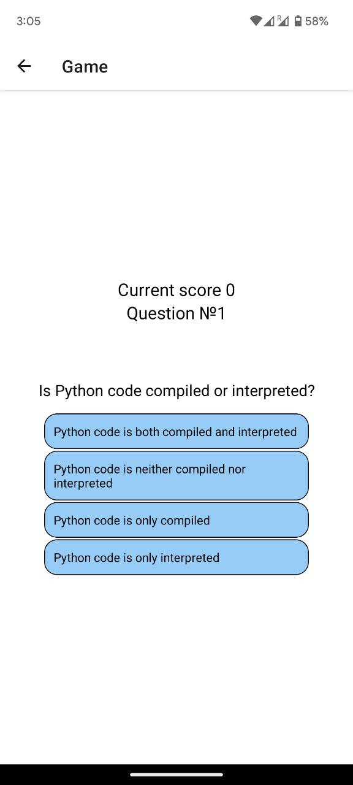

## Simple Mobile Question Game Boilerplate based on React Native and Django Channels

This boilerplate is made for fun as my first experience making mobile apps with React Native as a frontend and Django Channels as a backend. You can use it as a boilerplate of your mobile app or just test how to use Websockets with mobile apps to transfer data.

So the main plot of game is very simple - answer all questions and win the game! You can add your own questions by changing file `backend/game/questions.csv` or load questions from wherever you want. 

### App consists off:

- Django backend server (protocol server Daphne, Redis for Channels Layers)
- React Native project for frontend mobile app

### Setting up for development with Expo Go
For development purposes I use Expo Go app, that allows coding without installing IOS or Android native's SDK. Only one thing you need to do is install Expo Go (https://expo.dev/client) on your smartphone.

- Create python virtual environment and switch to it
- Install requirements - `python pip install -r requirements.txt`
- Build Redis and Postgres docker images - `docker-compose -f docker-compose-dev.yml up`
- Migrate Django db - `cd backend && python manage.py migrate`
- Add React Native components: `cd QuestionGame && npm install`

### Basic Commands

1. Create django admin - `python manage.py createsuperuser`. 
2. Start Redis and Postgres - `docker-compose -f docker-compose-dev.yml up`
3. Start backend server - `python manage.py runserver 0.0.0.0:8000`
4. Change your backend server IP (use local network IP if you're going to test with your smartphone with Expo Go app) in `QuestionGame/env.js`
3. Start frontend - `cd QuestionGame/ && npx expo start`
4. Now you can use Expo Go on your smartphone to test (more info - https://reactnative.dev/docs/environment-setup)

### Features

1. Simple JWT authentication for storing results board
1. Transfering game data using Websocket
3. Storing game results in db

### Screenshot

